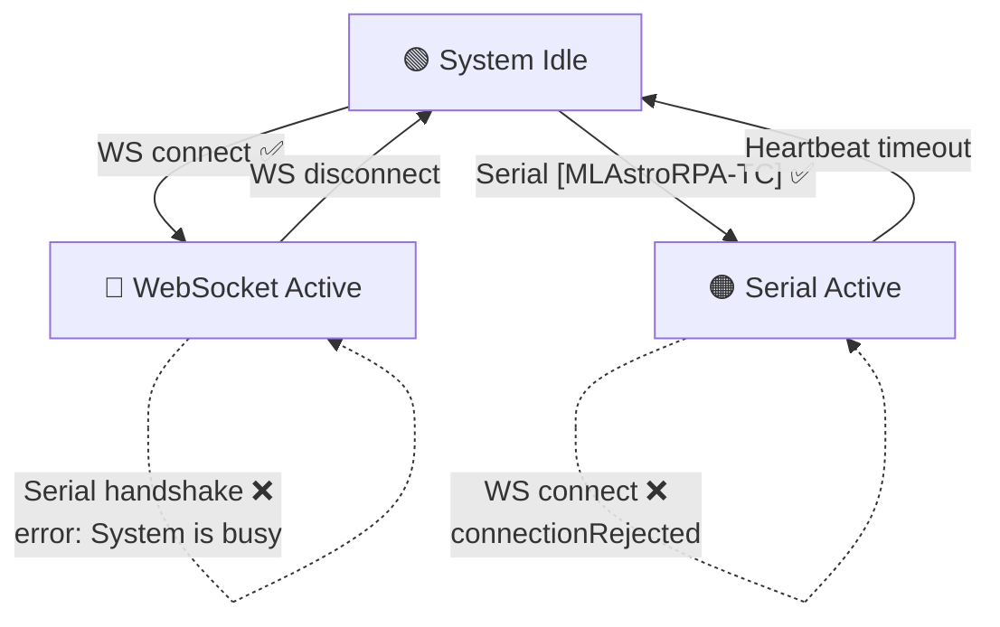

# Changelog

All notable changes to MLAstroRPA Webserver will be documented in this file.

---

## [1.2.43] - 2026-07-07

### 🔒 Changed — Single-Session Connection Control

Previously, when a new connection (WebSocket or Serial) was established, the system would forcibly take control from the existing session. This "take control" logic has been replaced with a **single-session** mechanism: only **one** control session is allowed at any time. New connections are rejected if the system is already busy.

#### 🎯 Connection State Machine

#### Backend Changes

| File | Change |
|---|---|
| `src/Web/WebControl.cpp` | `WS_EVT_CONNECT`: checks `serialHasControl` and existing WebSocket client count. If system is busy → sends `{"cmd":"connectionRejected","reason":"..."}` then closes the connection. **No longer** forcibly takes over Serial or kicks existing clients. |
| `src/main.cpp` | Serial handshake `[MLAstroRPA-TC]`: checks `ws.count() > 0` before accepting. If a WebSocket client is active → returns `error: System is busy. Web client is connected.`. Serial messages without control permission → return `error: Not connected.` instead of being silently ignored. |

#### Frontend Changes

| File | Change |
|---|---|
| `data/index.html` | Added `#connection-locked-overlay` — fullscreen overlay with 🔒 icon, displays the rejection reason from server, and a "Close This Page" button. |
| `data/style.css` | Added styles for `.connection-locked-overlay` and `.connection-locked-card` with `fadeIn` + `slideUp` animations, red border, hover effects. |
| `data/script.js` | `ws.onmessage` intercepts `connectionRejected` → calls `showConnectionLockedOverlay()` → closes WebSocket + blocks auto-reconnect. `showConnectionLockedOverlay()` locks the entire page, only allows closing the tab. |

#### Behavior Matrix

| System State | New WebSocket | New Serial Handshake |
|---|---|---|
| 🟢 **Idle** (no active sessions) | ✅ Accepted | ✅ Accepted |
| 🔵 **WebSocket Active** | ❌ `connectionRejected` | ❌ `error: System is busy` |
| 🟠 **Serial Active** | ❌ `connectionRejected` | ❌ (already has Serial, no second session possible) |

### 🆔 Added — Serial Handshake Returns Device Identity

The Serial handshake response now includes firmware version and device serial number (base MAC address).

| Before | After |
|---|---|
| `ok` | `ok,firmware 1.2.43,SN:AA:BB:CC:DD:EE:F0` |

**Source:** `src/main.cpp` — `networkTask()` handshake block. Uses `esp_efuse_mac_get_default()` for the permanent factory MAC.

### 🔐 Changed — WiFi Passwords Removed from Telemetry; MAC Addresses Added

WiFi passwords (`APpa`, `STAp`) have been **removed** from the periodic `?\n` telemetry stream for security. They are replaced by MAC addresses (`APma`, `STAm`).

| Telemetry Key | Before | After |
|---|---|---|
| `APpa` | AP password (plaintext) | **Removed** |
| `STAp` | STA password (plaintext) | **Removed** |
| `APma` | — | AP MAC address (e.g. `AA:BB:CC:DD:EE:F1`) |
| `STAm` | — | STA MAC address (e.g. `AA:BB:CC:DD:EE:F0`) |

### ➕ Added — Standalone Password Query Commands

Two new read-only query commands for retrieving WiFi passwords on demand:

| Command | Response |
|---|---|
| `STAp:?\n` | `STAp:myWiFiPassword\n` |
| `APpa:?\n` | `APpa:myAPPassword\n` |

Set commands (`STAp:X\n`, `APpa:X\n`) continue to work as before.

**Files changed:** `src/Serial/SerialControl.cpp`, `src/Serial-protocol.md`, `src/main.cpp`

### 📋 Added — Build Script Copies CHANGELOG.md to HardwareUpdate

The release build script (`.vscode/BUILD-REALEASE.py`) now copies `CHANGELOG.md` to the `HardwareUpdate/` directory alongside firmware artifacts for distribution.

---

## [1.2.42] and earlier

See git history for changes prior to this version.
