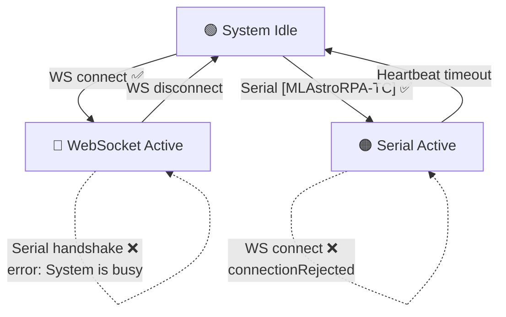

# Changelog

All notable changes to MLAstroRPA Webserver will be documented in this file.

---

## [1.2.66] - 2026-08-28

### Changed — Serial Handshake Takes Priority Over Web

- Serial now always wins the handshake. When the Web UI already holds control and Serial sends `[MLAstroRPA-TC]`, the firmware **immediately releases the Web handshake** (`webHasControl=false`, `webMasterClientId=0`), cancels Web workflows + stops motors, and notifies the Web client with `{"cmd":"controlTakenBySerial","serial_locked":true,...}` so it switches to monitor-only.
- The Web UI only re-handshakes on **refresh** (once Serial releases the handshake). While Serial holds control, a connected (or newly connecting) Web client is locked to **read-only monitoring** — no control commands accepted.
- Previously Serial was refused (`error: System is busy. Web client is connected.`) when Web held control.

**Files:** `src/main.cpp`, `data/script.js`

### Fixed — Serial Handshake Dropped When Communication Watchdog Disabled

- When **Enable Communication Watchdog** was unchecked, the firmware still silently freed the Serial handshake after `SERIAL_DISCONNECT_TIMEOUT_MS` (10 s) without a `?` poll.
- Cause: the heartbeat timestamp (`lastSerialHeartbeatQueryTime`) was refreshed **only** by `?` polls — any other received command (jog, align, config, …) did not count as activity, so an active command-only session looked "disconnected" and was dropped. After the drop, every subsequent command was answered with `error: Not connected. Send [MLAstroRPA-TC] to take control.`
- Fix:
  - **Any** received serial command now refreshes the heartbeat while the Serial session holds control (commands no longer look like a dead link).
  - **Watchdog OFF now never releases the handshake**, even after long silence — the handshake is held until the device is rebooted (the user reboots if neither side can connect). The 10 s `SERIAL_DISCONNECT_TIMEOUT_MS` release path was removed (constant deleted).
  - **Watchdog ON** still E-STOPs and releases control after `SERIAL_HEARTBEAT_TIMEOUT_MS` (1.2 s) of no traffic.

**Files:** `src/main.cpp`, `src/Serial/SerialControl.cpp`, `src/Serial/SerialControl.h`

### Added — Serial `Disconnect` Command (Graceful Handshake Release)

- New firmware command `Disconnect\n`: stops motors smoothly and releases the Serial control handshake, returning the handshake to the **free** state without needing a reboot.
- The NINA plugin now sends `Disconnect\n` best-effort right before the port is closed in `Disconnect()` (covers the Connect/Disconnect button and every disconnect path where the port is still open).
- Essential when **Enable Communication Watchdog is disabled**, because the firmware then never auto-releases the handshake.

**Files:** `src/Serial/SerialControl.cpp`, `Services/SerialConnectionService.cs`, `src/Serial-protocol.md`

### Added — Independent Error Telemetry over Serial (`ERROR:` line)

- Firmware now reports **all** error/warning codes in one dedicated telemetry line: `ERROR:Sys,AzNC,AlNC,AzOT,AlOT,AzPW,AlPW,AzSA,AzSB,AlSA,AlSB,AzOL,AlOL,AzHL,AlHL,AzSL,AlSL,Esc`.
- Each code is `0` = OK, `1` = WARNING, `2` = ERROR; all 18 codes are always present (never truncated).
- Sent **only when the state changes** (edge-triggered) — independent of the `?` polling — and **only while the Serial session holds control** (never when the Web controls). The line waits for free TX space so it never clips a telemetry response.
- On a successful handshake the current error state is pushed **immediately** after `ok,firmware,SN:...` (`resetErrorTelemetrySent()`).
- Log keyword `CRITICAL` renamed to `ERROR`.

**Files:** `src/Serial/SerialControl.cpp`, `src/Serial/SerialControl.h`, `src/main.cpp`

### Added — Post-Start Driver Connectivity Check + System Lock

- When a jog/align command starts an axis, the driver is checked **right after the move is issued** (not before, not on the periodic scan): `DRV_STATUS` read failure → **Driver Not Responding**; over-temperature / short-to-ground → **Driver Fault**.
- On failure the axis is stopped immediately, `hasDriverError = true` → Core 1 emergency-stops + repeats the ERROR beep/status LED, the system status becomes `ERROR`, and the ERROR telemetry (`AzNC`/`AlNC`/OT/SA/SB) is raised. Recover via **Reset Error** (`ReER:1` / Web button).
- While locked, movement commands are answered `error: System Locked`; the Web UI shows a **WARNING** log line and disables the movement controls.

**Files:** `src/Serial/SerialControl.cpp`, `src/Steper/Steper.cpp`, `src/Steper/Steper.h`, `src/Web/WebControl.cpp`, `src/main.cpp`

### Changed — Main Telemetry Cleaned Up (protocol-accurate)

- Removed the test diagnostic fields `AzOL`/`AlOL`/`AzSG`/`AlSG` (and their periodic `DRV_STATUS`/`SG_RESULT` reads) from the main `<...>` telemetry — they reported error-like values that were not part of the protocol.
- Error reporting now lives exclusively in the dedicated `ERROR:` line; the main telemetry is also lighter (no periodic driver UART reads).

**Files:** `src/Serial/SerialControl.cpp`

### Added — Web System Log: replay, dedup and Reset cleanup

- On WebSocket connect the recent system log is replayed so boot-time errors are visible after a page refresh; repeated identical messages are deduplicated; transient noise lines (client disconnect, reset notices) are filtered out.
- **Reset Error** clears the recent-log buffer so stale errors are not replayed after a reset.
- The "System is locked by PC (Serial Control is Active)" message is now logged as **WARNING** (orange).
- **SystemLog parity for Serial (UART) control**: the serial command path now logs the same motion start/stop events as the Web UI — `MANUAL MOVING`, `Command: Return to Home received`, `ALIGN STARTED`, `STOPPED`/`FORCED STOP` cancellation — so the Web System Log shows a consistent "started … completed" story no matter which interface started the motion.

**Files:** `src/Web/WebControl.cpp`, `src/main.cpp`, `src/Serial/SerialControl.cpp`, `data/script.js`

### Added — Web "Enable Communication Watchdog" quick toggle

- New checkbox in the **CONTROL** tab Serial Log header (before Show RX), behaving exactly like the checkbox in Admin Config: synced 2-way and applied + persisted immediately via the new `setCommWatchdog` WebSocket command.

**Files:** `data/index.html`, `data/script.js`, `src/Web/WebControl.cpp`

---

## [1.2.65] - 2026-08-27

### Fixed — Alignment Values Not Updating While Running (Telemetry Cache)

- The **Alignment** tab values (Az/Alt error set via `AzED`/`AzEM`/`AzES`/`AzDi`/`AlED`/`AlEM`/`AlES`/`AlDi`) were still echoing **old telemetry** after changing values and starting a new run.
- Cause: the telemetry segment `s_segA` is only rebuilt when the motors stop; values set while idle were cached and the stale copy was re-sent during the next align.
- Fix: a `telemetryCacheDirty` flag is set on every Az/Alt error/direction command and forces the cache to rebuild immediately — even while motors are running — then clears itself.

**Files:** `src/Serial/SerialControl.cpp`

### Added — Open-Load / Motor-Not-Connected Detection (StallGuard Back-EMF)

- Firmware now reports an ERROR when a motor is **not connected / no back-EMF** while the axis is running (open circuit).
- The TMC2209 **OLA/OLB** bits are **not reliable** on this hardware, so detection uses **StallGuard `SG_RESULT`** (back-EMF): when the axis is running and `SG_RESULT < 5` for **4 consecutive checks (~2 s)**, after an 800 ms settle window, → `CRITICAL: Motor not connected / no back-EMF!` → `hasDriverError` → motors stop + ERROR beep. The longer debounce prevents false open-load from transient SG pulses while the motor drives a gearbox.
- Open-load detection uses **only `SG_RESULT`** (back-EMF); DIAG is not used (it can assert falsely during acceleration/gearbox operation). The open-load telemetry bit (`AzOL`/`AlOL`) and ERROR/WARNING logs are only emitted **after confirmation** — never during the checking/debounce phase — so the Alarm table cannot show an error while the motor is still running.
- Works in **both SpreadCycle and StealthChop**.
- New telemetry diagnostics: **`AzOL` / `AlOL`** (0=ok, 1=open A, 2=open B, 3=both, 9=driver not responding) and **`AzSG` / `AlSG`** (StallGuard value), refreshed every 1000 ms.

**Files:** `src/Steper/Steper.cpp`, `src/Serial/SerialControl.cpp`, `src/Steper/Steper.h`

### Changed — Driver Reads Gated to Boot + Open-Load Window (fixes false "Driver communication lost")

- While a motor is **running**, `DRV_STATUS` UART reads are blocked/fail (return `0`) — this caused **false "Driver communication lost"** errors on a healthy axis.
- Drivers are now only read:
  1. During the **boot window** (`DRIVER_BOOT_CHECK_MS = 5000 ms`, motors idle) → 3 consecutive bad reads → `CRITICAL: Driver not connected at startup!`
  2. Within the **open-load window** (`DRIVER_OPENLOAD_WINDOW_MS = 6000 ms` right after an axis starts running, with an 800 ms settle period) → `SG_RESULT` used for no-motor detection; `DRV_STATUS` read failures are **ignored** while running.
- After the window, reading stops until the axis stops — removing UART pressure during motion and eliminating the false communication-loss error.

**Files:** `src/Steper/Steper.h`, `src/Steper/Steper.cpp`

### Fixed — Open-Load No Longer Misreported as Hard Limit (no reverse-run)

- When the motor is not connected, `SG_RESULT ≈ 0 < SGTHRS` makes the TMC2209 **DIAG pin assert** → Core 1's hard-limit protection misread it as a physical hard limit → entered **Escape mode (ran the motor in reverse)** + reported `CRITICAL: AZ/ALT Hardlimit!`.
- **DIAG is now detected on Core 0** (`checkAndLogDriverErrors`) via direct GPIO reads (no UART, no glitch) and combined with `SG_RESULT`.
- Shared `azOpenLoadActive` / `altOpenLoadActive` flags coordinate both cores:
  - Core 1 sets the flag when an axis starts running (pending motor check).
  - Core 0 sets it true when open-load is suspected, false when the motor is confirmed.
  - When the flag is active, Core 1 **clears all hard-limit flags** (`stall_start`, `escaping`, `blocked_dir`) and **skips DIAG hard-limit detection**.
- Net effect: an axis without a motor reports **open-load** (never a hard limit, never reverse-runs); a real hard limit with a connected motor still works normally.

**Files:** `src/Steper/Steper.cpp`, `src/Steper/Steper.h`, `src/main.cpp`

### Changed — Hard Limits UI Reorganized under Admin Config

- The **Hard Limits (Sensorless)** panel was moved from its own top-level panel into the **Admin Config** section as a child block, placed directly under **Sensorless Auto Tuning** and above **Travel Calibration**.
- All input IDs (`az-sg-*`, `alt-sg-*`, `az-tcool-*`, `alt-tcool-*`, `stall-time`, `escape-rotations`, `enable-hardlimit`) are unchanged, so the existing JS keeps working.

**Files:** `data/index.html`

---

## [1.2.64] - 2026-08-26

### Fixed — 3-Beep ERROR Alert for Hardlimit & Motor Error

- **Hardlimit** (StallGuard tripped) and **Motor/Driver Error** now trigger `BEEP_ERROR` (**3 beeps**, repeated every 5 s while the error persists) — previously the `triggerBeep(BEEP_ERROR)` calls were **dead code** after an unconditional `return`, so no alert sounded.
- Buzzer/status-LED is silenced immediately (`triggerBeep(BEEP_IDLE)`) when the error is reset — both via the Web UI **Reset Error** button and the Serial `ReER:1` command.

**Files:** `src/main.cpp`, `src/Web/WebControl.cpp`, `src/Serial/SerialControl.cpp`

### Added — Serial RESET ERROR Command (`ReER:1`)

- New serial command `ReER:1` clears the driver error state and returns the system to `READY`, behaving exactly like the **Reset Error** button in the Web UI System Log.
- Stops both motors (inside the stepper critical section), sets `hasDriverError = false`, and replies `ok`.
- **No TX echo** — the Serial Log stays clean (only `ok` is replied over Serial); the message `System Error Reset by User.` is written to the **web System Log** in orange (same as the Web UI Reset Error button).
- `ReER:0` is ignored (button release event), consistent with other UI-mapped commands.
- The command is **not** gated by `error: System Locked`, so it can always recover the system from an error state.
- Documented in `src/Serial-protocol.md` under **System & Stop Commands**.

**Files:** `src/Serial/SerialControl.cpp`, `src/Serial-protocol.md`

---

## [1.2.59] - 2026-08-18

### Added — Alt P.A Overshoot Direction Checkboxes

- Two new checkboxes **Move up overshoot** and **Move down overshoot**, nested under **Enable Alt P.A Overshoot on firmware**.
- Persisted to FRAM (marker `0xAB`); applied per-direction in the Alt-axis two-leg overshoot routine.
- The master **Enable Alt P.A Overshoot** switch still gates both directions. **Move down overshoot** defaults ON to preserve prior behavior.
- Serial: new `OvUp:X` / `OvDn:X` set commands and `OvUp` / `OvDn` telemetry fields.

**Files:** `src/FRAM/ConfigManager.h`, `src/main.cpp`, `src/Serial/SerialControl.cpp`, `src/Web/WebControl.cpp`, `data/index.html`, `data/script.js`

### Changed — Backlash & P.A Overshoot UI

- Panel renamed from **Backlash & Overshoot** to **Backlash & P.A Overshoot**.
- Checkbox renamed to **Enable Alt P.A Overshoot on firmware**.
- **Az/Alt backlash** inputs and the overshoot sub-options are indented under their parent checkboxes for clearer hierarchy.

**Files:** `data/index.html`

### Fixed — Intermittent FRAM Save (SAVE ALL & REBOOT)

- `saveConfig` now reads FRAM **once** and writes **once**, instead of ~7 separate read-modify-write operations that could race with the Core 0 save queue and lose config.
- Save queue re-checks `configSaveInProgress` after reading, before writing, to avoid overwriting a fresh config with a stale copy.

**Files:** `src/Web/WebControl.cpp`, `src/main.cpp`

### ⚡ Changed — Auto-center FRAM Write Moved to Core 0

- Auto-center completion no longer writes FRAM directly on Core 1; it pushes a `SaveRequest` to the Core 0 save queue.
- `SaveRequest` extended with factory-zero fields (`factory_zero_az_steps`, `factory_zero_alt_steps`, `has_factory_zero`).
- Removed a redundant `homed` WebSocket push on Core 1 (Core 0 already broadcasts it every 250 ms).

**Files:** `src/main.cpp`

## [1.2.58] - 2026-08-17

### Added — Swap Az-Alt Motor Ports

New **Swap Az-Alt motor ports** checkbox in Admin Config (right above "Show hardlimit monitor").

- Persisted to FRAM (marker `0xAA`); takes effect after reboot.
- Swaps, in software, the two motor ports:
  - STEP/DIR pins (`AccelStepper::setPins()` runtime remap).
  - Logical TMC2209 driver mapping via `AZ_DRV` / `ALT_DRV` pointers.
  - DIAG pin mapping (StallGuard / hard-limit monitor and protection).

**Files:** `lib/AccelStepper/src/AccelStepper.{h,cpp}`, `src/FRAM/ConfigManager.h`, `src/Steper/Steper.{h,cpp}`, `src/main.cpp`, `src/Serial/SerialControl.cpp`, `src/Web/WebControl.cpp`, `data/index.html`, `data/script.js`

### Changed — 5 s Non-Blocking Reboot Countdown

- Serial `Save&Reboot` now counts down **5 s without blocking**: `networkTask` keeps processing logs, FRAM saves and telemetry while printing one dot per second, then reboots.
- Web **SAVE ALL & REBOOT** countdown increased from 3 s to 5 s.

**Files:** `src/Serial/SerialControl.cpp`, `src/Serial/SerialControl.h`, `src/main.cpp`, `data/script.js`

### Fixed — REBOOTING Status Maintained Until Reboot

- Backend reports `sys_status = "REBOOTING"` while a reboot countdown is pending.
- Frontend keeps the `REBOOTING` status (periodic `READY` updates no longer overwrite it) and resets on a fresh WebSocket connection.

**Files:** `src/main.cpp`, `data/script.js`

## [1.2.57] - 2026-08-17

### Changed — Explicit Handshake Ownership (Serial vs Web)

Control handshake is now explicitly owned by a single master and is **no longer auto-transferred** when the current master disconnects.

| Before | After |
|---|---|
| Serial disconnect → `serialHasControl=false` → Web auto-unlocked | Serial disconnect → handshake becomes **free**; Web stays locked until a **new** connection handshakes |
| Web control implied by `!serialHasControl` | New `webHasControl` flag marks the Web master explicitly |

- Handshake is granted **only** on a new connection (`WS_EVT_CONNECT` or Serial `[MLAstroRPA-TC]`) and only when the handshake is free.
- Web master disconnect releases the handshake and stops motors. A read-only client disconnect no longer stops motors or affects the Serial session.

**Files:** `src/main.cpp`, `src/Web/WebControl.cpp`, `src/Serial/SerialControl.cpp`, `src/Serial/SerialControl.h`

### Added — Read-Only Web Access During Serial Control

When the PC (Serial) holds control, the web UI can still connect and view realtime values instead of being rejected.

- All control buttons are locked (dimmed).
- A red `ERROR: System is locked by PC (Serial Control is Active).` line is written to System Log instead of showing the connection-rejected modal.
- The `connectionRejected` modal now only appears when a second web client attempts to connect.

**Files:** `src/Web/WebControl.cpp`, `src/main.cpp`, `data/script.js`, `data/style.css`

### Added — Serial Log (TX/RX) Panel

- New **Serial Log (TX/RX)** panel showing received (`RX`) and transmitted (`TX`) serial lines, with `Show RX` / `Show TX` filters and a Clear button.
- **Show Serial logs** checkbox: persisted to FRAM (marker `0xA9`). Serial log packets are forwarded over WebSocket **only when enabled**, to avoid flooding WebSocket telemetry. A new `setSerialLog` command toggles and saves the setting.
- Fixed `TX null` entries: the `serial_log` JSON document was 512 B, smaller than the full idle telemetry (~600 B); increased to 800 B.

**Files:** `src/main.cpp`, `src/Serial/SerialControl.cpp`, `src/Serial/SerialControl.h`, `src/FRAM/ConfigManager.h`, `src/Web/WebControl.cpp`, `data/index.html`, `data/script.js`, `data/style.css`

### Added — Serial Command Replies Logged to Web

All Serial `ok` / `error: ...` replies are now logged as TX in the web Serial Log via a new `serialReply()` helper (align, jog, home, speed, settings, WiFi/AP, etc.). Previously only telemetry TX was logged, so command acknowledgements were invisible in the web UI.

**Files:** `src/Serial/SerialControl.cpp`

### Changed — UI & Log Panel Usability

- Panel collapse now toggles **only** via the arrow (chevron) area, not the whole header row.
- Serial log text is selectable for copy/paste.
- Log & monitor panel buttons (Clear, Export CSV, Reset Error, Show RX/TX) remain usable while the Serial master is active.

**Files:** `data/script.js`, `data/style.css`

---

## [1.2.43] - 2026-07-07

### Changed — Single-Session Connection Control

Previously, when a new connection (WebSocket or Serial) was established, the system would forcibly take control from the existing session. This "take control" logic has been replaced with a **single-session** mechanism: only **one** control session is allowed at any time. New connections are rejected if the system is already busy.

#### Connection State Machine

#### Backend Changes

| File | Change |
|---|---|
| `src/Web/WebControl.cpp` | `WS_EVT_CONNECT`: checks `serialHasControl` and existing WebSocket client count. If system is busy → sends `{"cmd":"connectionRejected","reason":"..."}` then closes the connection. **No longer** forcibly takes over Serial or kicks existing clients. |
| `src/main.cpp` | Serial handshake `[MLAstroRPA-TC]`: checks `ws.count() > 0` before accepting. If a WebSocket client is active → returns `error: System is busy. Web client is connected.`. Serial messages without control permission → return `error: Not connected.` instead of being silently ignored. |

#### Frontend Changes

| File | Change |
|---|---|
| `data/index.html` | Added `#connection-locked-overlay` — fullscreen overlay with 🔒 icon, displays the rejection reason from server, and a "Close This Page" button. |
| `data/style.css` | Added styles for `.connection-locked-overlay` and `.connection-locked-card` with `fadeIn` + `slideUp` animations, red border, hover effects. |
| `data/script.js` | `ws.onmessage` intercepts `connectionRejected` → calls `showConnectionLockedOverlay()` → closes WebSocket + blocks auto-reconnect. `showConnectionLockedOverlay()` locks the entire page, only allows closing the tab. |

#### Behavior Matrix

| System State | New WebSocket | New Serial Handshake |
|---|---|---|
| 🟢 **Idle** (no active sessions) | ✅ Accepted | ✅ Accepted |
| 🔵 **WebSocket Active** | ❌ `connectionRejected` | ❌ `error: System is busy` |
| 🟠 **Serial Active** | ❌ `connectionRejected` | ❌ (already has Serial, no second session possible) |

### 🆔 Added — Serial Handshake Returns Device Identity

The Serial handshake response now includes firmware version and device serial number (base MAC address).

| Before | After |
|---|---|
| `ok` | `ok,firmware 1.2.43,SN:AA:BB:CC:DD:EE:F0` |

**Source:** `src/main.cpp` — `networkTask()` handshake block. Uses `esp_efuse_mac_get_default()` for the permanent factory MAC.

### 🔐 Changed — WiFi Passwords Removed from Telemetry; MAC Addresses Added

WiFi passwords (`APpa`, `STAp`) have been **removed** from the periodic `?\n` telemetry stream for security. They are replaced by MAC addresses (`APma`, `STAm`).

| Telemetry Key | Before | After |
|---|---|---|
| `APpa` | AP password (plaintext) | **Removed** |
| `STAp` | STA password (plaintext) | **Removed** |
| `APma` | — | AP MAC address (e.g. `AA:BB:CC:DD:EE:F1`) |
| `STAm` | — | STA MAC address (e.g. `AA:BB:CC:DD:EE:F0`) |

### ➕ Added — Standalone Password Query Commands

Two new read-only query commands for retrieving WiFi passwords on demand:

| Command | Response |
|---|---|
| `STAp:?\n` | `STAp:myWiFiPassword\n` |
| `APpa:?\n` | `APpa:myAPPassword\n` |

Set commands (`STAp:X\n`, `APpa:X\n`) continue to work as before.

**Files changed:** `src/Serial/SerialControl.cpp`, `src/Serial-protocol.md`, `src/main.cpp`

### 📋 Added — Build Script Copies CHANGELOG.md to HardwareUpdate

The release build script (`.vscode/BUILD-REALEASE.py`) now copies `CHANGELOG.md` to the `HardwareUpdate/` directory alongside firmware artifacts for distribution.

---

## [1.2.42] and earlier

See git history for changes prior to this version.
