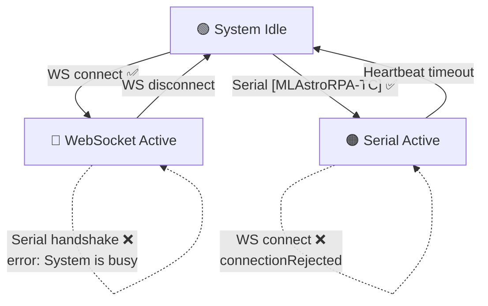

# Changelog

All notable changes to MLAstroRPA Webserver will be documented in this file.

---

## [1.2.58] - 2026-08-17

### 🔄 Added — Swap Az-Alt Motor Ports

New **Swap Az-Alt motor ports** checkbox in Admin Config (right above "Show hardlimit monitor").

- Persisted to FRAM (marker `0xAA`); takes effect after reboot.
- Swaps, in software, the two motor ports:
  - STEP/DIR pins (`AccelStepper::setPins()` runtime remap).
  - Logical TMC2209 driver mapping via `AZ_DRV` / `ALT_DRV` pointers.
  - DIAG pin mapping (StallGuard / hard-limit monitor and protection).

**Files:** `lib/AccelStepper/src/AccelStepper.{h,cpp}`, `src/FRAM/ConfigManager.h`, `src/Steper/Steper.{h,cpp}`, `src/main.cpp`, `src/Serial/SerialControl.cpp`, `src/Web/WebControl.cpp`, `data/index.html`, `data/script.js`

### ⏱️ Changed — 5 s Non-Blocking Reboot Countdown

- Serial `Save&Reboot` now counts down **5 s without blocking**: `networkTask` keeps processing logs, FRAM saves and telemetry while printing one dot per second, then reboots.
- Web **SAVE ALL & REBOOT** countdown increased from 3 s to 5 s.

**Files:** `src/Serial/SerialControl.cpp`, `src/Serial/SerialControl.h`, `src/main.cpp`, `data/script.js`

### 🟢 Fixed — REBOOTING Status Maintained Until Reboot

- Backend reports `sys_status = "REBOOTING"` while a reboot countdown is pending.
- Frontend keeps the `REBOOTING` status (periodic `READY` updates no longer overwrite it) and resets on a fresh WebSocket connection.

**Files:** `src/main.cpp`, `data/script.js`

## [1.2.57] - 2026-08-17

### 🔒 Changed — Explicit Handshake Ownership (Serial vs Web)

Control handshake is now explicitly owned by a single master and is **no longer auto-transferred** when the current master disconnects.

| Before | After |
|---|---|
| Serial disconnect → `serialHasControl=false` → Web auto-unlocked | Serial disconnect → handshake becomes **free**; Web stays locked until a **new** connection handshakes |
| Web control implied by `!serialHasControl` | New `webHasControl` flag marks the Web master explicitly |

- Handshake is granted **only** on a new connection (`WS_EVT_CONNECT` or Serial `[MLAstroRPA-TC]`) and only when the handshake is free.
- Web master disconnect releases the handshake and stops motors. A read-only client disconnect no longer stops motors or affects the Serial session.

**Files:** `src/main.cpp`, `src/Web/WebControl.cpp`, `src/Serial/SerialControl.cpp`, `src/Serial/SerialControl.h`

### 👁️ Added — Read-Only Web Access During Serial Control

When the PC (Serial) holds control, the web UI can still connect and view realtime values instead of being rejected.

- All control buttons are locked (dimmed).
- A red `ERROR: System is locked by PC (Serial Control is Active).` line is written to System Log instead of showing the connection-rejected modal.
- The `connectionRejected` modal now only appears when a second web client attempts to connect.

**Files:** `src/Web/WebControl.cpp`, `src/main.cpp`, `data/script.js`, `data/style.css`

### 📻 Added — Serial Log (TX/RX) Panel

- New **Serial Log (TX/RX)** panel showing received (`RX`) and transmitted (`TX`) serial lines, with `Show RX` / `Show TX` filters and a Clear button.
- **Show Serial logs** checkbox: persisted to FRAM (marker `0xA9`). Serial log packets are forwarded over WebSocket **only when enabled**, to avoid flooding WebSocket telemetry. A new `setSerialLog` command toggles and saves the setting.
- Fixed `TX null` entries: the `serial_log` JSON document was 512 B, smaller than the full idle telemetry (~600 B); increased to 800 B.

**Files:** `src/main.cpp`, `src/Serial/SerialControl.cpp`, `src/Serial/SerialControl.h`, `src/FRAM/ConfigManager.h`, `src/Web/WebControl.cpp`, `data/index.html`, `data/script.js`, `data/style.css`

### 🆗 Added — Serial Command Replies Logged to Web

All Serial `ok` / `error: ...` replies are now logged as TX in the web Serial Log via a new `serialReply()` helper (align, jog, home, speed, settings, WiFi/AP, etc.). Previously only telemetry TX was logged, so command acknowledgements were invisible in the web UI.

**Files:** `src/Serial/SerialControl.cpp`

### 🧰 Changed — UI & Log Panel Usability

- Panel collapse now toggles **only** via the arrow (chevron) area, not the whole header row.
- Serial log text is selectable for copy/paste.
- Log & monitor panel buttons (Clear, Export CSV, Reset Error, Show RX/TX) remain usable while the Serial master is active.

**Files:** `data/script.js`, `data/style.css`

---

## [1.2.43] - 2026-07-07

### 🔒 Changed — Single-Session Connection Control

Previously, when a new connection (WebSocket or Serial) was established, the system would forcibly take control from the existing session. This "take control" logic has been replaced with a **single-session** mechanism: only **one** control session is allowed at any time. New connections are rejected if the system is already busy.

#### 🎯 Connection State Machine

#### Backend Changes

| File | Change |
|---|---|
| `src/Web/WebControl.cpp` | `WS_EVT_CONNECT`: checks `serialHasControl` and existing WebSocket client count. If system is busy → sends `{"cmd":"connectionRejected","reason":"..."}` then closes the connection. **No longer** forcibly takes over Serial or kicks existing clients. |
| `src/main.cpp` | Serial handshake `[MLAstroRPA-TC]`: checks `ws.count() > 0` before accepting. If a WebSocket client is active → returns `error: System is busy. Web client is connected.`. Serial messages without control permission → return `error: Not connected.` instead of being silently ignored. |

#### Frontend Changes

| File | Change |
|---|---|
| `data/index.html` | Added `#connection-locked-overlay` — fullscreen overlay with 🔒 icon, displays the rejection reason from server, and a "Close This Page" button. |
| `data/style.css` | Added styles for `.connection-locked-overlay` and `.connection-locked-card` with `fadeIn` + `slideUp` animations, red border, hover effects. |
| `data/script.js` | `ws.onmessage` intercepts `connectionRejected` → calls `showConnectionLockedOverlay()` → closes WebSocket + blocks auto-reconnect. `showConnectionLockedOverlay()` locks the entire page, only allows closing the tab. |

#### Behavior Matrix

| System State | New WebSocket | New Serial Handshake |
|---|---|---|
| 🟢 **Idle** (no active sessions) | ✅ Accepted | ✅ Accepted |
| 🔵 **WebSocket Active** | ❌ `connectionRejected` | ❌ `error: System is busy` |
| 🟠 **Serial Active** | ❌ `connectionRejected` | ❌ (already has Serial, no second session possible) |

### 🆔 Added — Serial Handshake Returns Device Identity

The Serial handshake response now includes firmware version and device serial number (base MAC address).

| Before | After |
|---|---|
| `ok` | `ok,firmware 1.2.43,SN:AA:BB:CC:DD:EE:F0` |

**Source:** `src/main.cpp` — `networkTask()` handshake block. Uses `esp_efuse_mac_get_default()` for the permanent factory MAC.

### 🔐 Changed — WiFi Passwords Removed from Telemetry; MAC Addresses Added

WiFi passwords (`APpa`, `STAp`) have been **removed** from the periodic `?\n` telemetry stream for security. They are replaced by MAC addresses (`APma`, `STAm`).

| Telemetry Key | Before | After |
|---|---|---|
| `APpa` | AP password (plaintext) | **Removed** |
| `STAp` | STA password (plaintext) | **Removed** |
| `APma` | — | AP MAC address (e.g. `AA:BB:CC:DD:EE:F1`) |
| `STAm` | — | STA MAC address (e.g. `AA:BB:CC:DD:EE:F0`) |

### ➕ Added — Standalone Password Query Commands

Two new read-only query commands for retrieving WiFi passwords on demand:

| Command | Response |
|---|---|
| `STAp:?\n` | `STAp:myWiFiPassword\n` |
| `APpa:?\n` | `APpa:myAPPassword\n` |

Set commands (`STAp:X\n`, `APpa:X\n`) continue to work as before.

**Files changed:** `src/Serial/SerialControl.cpp`, `src/Serial-protocol.md`, `src/main.cpp`

### 📋 Added — Build Script Copies CHANGELOG.md to HardwareUpdate

The release build script (`.vscode/BUILD-REALEASE.py`) now copies `CHANGELOG.md` to the `HardwareUpdate/` directory alongside firmware artifacts for distribution.

---

## [1.2.42] and earlier

See git history for changes prior to this version.
