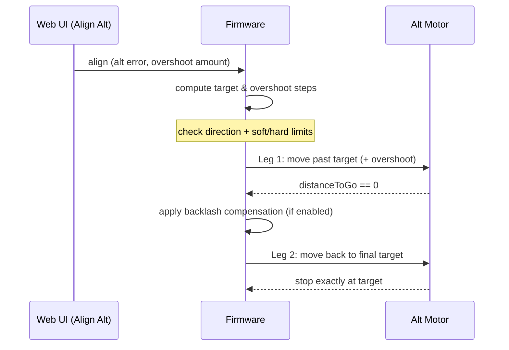

# MLAstroRPA — Firmware & Web UI Update

Official release repository for the **MLAstroRPA** Robotic Polar Alignment mount. This repository hosts the firmware and Web UI (SPIFFS) packages that the device uses when you run an update.

---

## What's in this repository

| Path | Description |
|---|---|
| `firmware X.Y.Z.bin` | ESP32 application firmware (versioned). |
| `spiffs X.Y.Z.bin` | Web UI assets (`index.html`, `script.js`, `style.css`). |
| `bootloader.bin` | ESP32 bootloader (rarely changes). |
| `partitions.bin` | Partition table with OTA support. |
| `meta.json` | Release metadata consumed by the update tool. |
| `CHANGELOG.md` | Version history and release notes. |
| `docs/` | The update web tool (served via GitHub Pages). |

---

## Update the device (recommended — no tools required)

1. Open the update page in a Chromium browser (Chrome / Edge):

   **https://mlastrorpa.github.io/Update/**

2. Click **🔍 CHECK FOR UPDATES**.
3. Select the version you want to install (Firmware and/or Web UI).
4. Follow the on-screen instructions to install using one of the two paths:
   - **OTA (over Wi-Fi)** — when the device is already connected to your network.
   - **USB Serial (Web Serial)** — connect the device to the PC with a USB cable.

> ⚠️ Do not power off or disconnect the device during the update.

---

## Using the MLAstroRPA Webserver

### 1. Power & connect

- Power on the mount. It either creates an Access Point or joins the saved Wi-Fi network.
- Default Access Point settings:
  - SSID: `MLAstro RPA`
  - Password: `MLAstro RPA`
  - IP: `192.168.4.1`

### 2. Open the Web UI

- Browse to the device IP (e.g. `http://192.168.4.1`).
- The page automatically connects to the WebSocket endpoint `/ws`.

### 3. Basic workflow

The Web UI is split into two tabs:

- **🎮 CONTROL** — everything you use during a session: moving the mount, monitoring, polar alignment, and logs.
- **🛠️ CONFIG** — all limits, motor, network, calibration and save actions.

A normal session follows the **MAN → AUTO → SAFETY → CONFIG & SAVE** workflow below.

#### 3.1 MAN — Manual movement (🎮 CONTROL → 🕹️ Manual Movement)

1. Pick a **Speed Level (1–5)** — higher levels move faster.
2. Choose a move mode:
   - **Jog (Hold)** — press and hold an arrow to move continuously; release to stop.
   - **Relative (Step)** — set a step size in degrees / arcminutes / arcseconds, then press an arrow once to move exactly that amount.
3. Use the directional pad: **▲/▼ Altitude**, **◄/► Azimuth**, **⏹** to stop.
4. In an emergency, hit the red **FORCE STOP** button in the header — it halts both axes immediately.

The **📐 Position** panel shows current Azimuth/Altitude (from home), step counters, output speed and the **Homed** status. From there you can:

- **🏠 SET HOME HERE** — mark the current position as home.
- **↻ RETURN TO HOME** — move both axes back to home.
- **⚠️ RESET HOME** — clear the home reference.

#### 3.2 AUTO — Polar alignment (🎮 CONTROL → 🎯 Polar Alignment)

1. In **Alt Error** / **Az Error**, enter the measured error in Deg / Min / Sec.
2. Choose the correction direction: **Up/Down** for Alt, **Left/Right** for Az.
3. Click **Align Alt** or **Align Az** to correct a single axis, or **✓ ALIGN ALL** to correct both at once.
4. Watch **Azimuth Moved** / **Altitude Moved** to see the applied correction.

**Automatic calibration** (used to compute exact `steps/degree` after mechanics or microstep changes):

- Go to **🛠️ CONFIG → 🔑 Admin Config → Travel Calibration**.
- Set the **Travel Angle** for Azimuth (default 20°) and Altitude (default 30°).
- Click **AZ Calib**, **ALT Calib** or **Calib All**. The axis travels to both hard limits — **make sure the path is clear**.
- When the result appears, either **Apply Steps/Deg Only** or **Apply result & Auto center** (moves back to center and sets home).
- **Sensorless Auto Tuning** (same area) auto-configures the StallGuard thresholds per speed level (`AZ/ALT SGTHRS`) and per microstep (`AZ/ALT TCOOL`) instead of entering values by hand.

> Calibration requires **Hard Limits to be enabled first** — the Web UI warns you if they are not.

#### 3.3 SAFETY — Limits & monitoring

- **📏 Soft Limits** (🛠️ CONFIG): enable and set the AZ (±9°) and ALT (±14°) travel range in degrees. The mount refuses moves outside this range.
- **🛡️ Hard Limits (Sensorless / StallGuard)** (🛠️ CONFIG): enter the **SGTHRS** value for each speed level (1–5) and **TCOOLTHRS** for each microstep on both axes, set **Debounce Time** and **Escape Rotations**, then tick **Enable Hard Limit**. When a stall is detected the axis stops and backs off.
- **📈 Hardlimit Monitor** (🎮 CONTROL): live chart of AZ/ALT StallGuard load and motor current while moving — great for verifying threshold values (enable **Show hardlimit monitor** in Admin Config).
- Header **FORCE STOP** and **⚠️ RESET ERROR** (in **📋 System Log**) let you stop and clear error states after a limit trip.
- In **🔑 Admin Config**, keep **Enable Communication Watchdog** on so the mount performs an E-STOP if the control app loses the heartbeat.

#### 3.4 CONFIG & SAVE (🛠️ CONFIG tab)

- **⚙️ Motor Driver (TMC2209)** — per-axis **Run/Hold current**, **Start-up Booster**, **Soft CoolStep**, **Microsteps**, **Accel/Decel**, **Steps/Degree**, **StealthChop / SpreadCycle** mode and **Reverse Direction**.
- **↔️ Backlash & P.A Overshoot** — anti-backlash compensation in steps, and the Alt P.A overshoot (direction + amount) used by the two-leg alignment move.
- **📶 WiFi Configuration** — Access Point (SSID/password/IP) and Station mode (connect to your router, scan for networks, see connected clients).
- **🔑 Admin Config** — serial port settings, swap Az-Alt motor ports (reboot required), show hardlimit monitor / steps, factory zero, max motor RPM, sensorless auto tuning, travel calibration, and password change.

Finally, use **💾 Configuration Management** to commit your changes:

| Button | What it does |
|---|---|
| **⚡ APPLY SETTINGS** | Apply to RAM only — lost on reboot. Good for quick tests. |
| **✓ SAVE ALL & REBOOT** | Persist everything to FRAM and reboot. Use this to keep changes. |
| **⏻ REBOOT** | Reboot without saving (discards unapplied changes). |
| **⚠️ FACTORY RESET** | Restore factory defaults. |

##### 3.4.1 CONFIG reference (in detail)

The CONFIG tab is split into eight collapsible panels. All values are stored in non-volatile FRAM memory and only become permanent when you press **✓ SAVE ALL & REBOOT**.

###### 🛡️ Hard Limits (Sensorless / StallGuard)

Uses the TMC2209 **StallGuard** current sensing to detect the mechanical hard stops without any physical switch — when the motor is blocked, the load rises, `SG_RESULT` drops below the threshold and a stall is reported, so the axis stops and backs off.

| Setting | Meaning |
|---|---|
| **Azimuth / Altitude SGTHRS (S1–S5)** | StallGuard sensitivity threshold for each speed level 1–5 (0–255). **Higher = more sensitive** (triggers earlier). Verify against real load with the **Hardlimit Monitor** chart. |
| **AZ / ALT TCOOLTHRS Presets (MS 2–64)** | Speed threshold (`TSTEP`) at which StallGuard becomes active, per microstep. Set `0` to let the firmware **auto-calculate** (~95% speed), or use **Sensorless Auto Tuning → TCOOL**. |
| **Debounce Time (ms)** | How long a stall signal must persist before it is confirmed (filters noise). |
| **Escape Rotations (revs)** | How many revolutions the axis backs off after a stall. |
| **Enable Hard Limit** | Master switch for StallGuard detection. **Must be enabled before Travel Calibration / Sensorless Auto Tuning** (the Web UI warns you otherwise). |

###### 📏 Soft Limits (Degrees)

Software limits — the mount refuses to move outside the configured angle range (measured from home).

- **Enable Soft Limit** — turn software limits on/off.
- **AZ Min / Max** — azimuth range (default ±9°).
- **ALT Min / Max** — altitude range (default ±14°).

> Min must be smaller than Max — the Web UI validates this before applying/saving.

###### ⚙️ Motor Driver (TMC2209)

Configured independently for the **AZ Motor** and **ALT Motor** (tick **Reverse Direction** if a motor spins the wrong way).

| Setting | Meaning |
|---|---|
| **Run Current (mA)** | Current while the motor is moving. |
| **Hold Current (mA)** | Current while the motor is stationary (auto-capped at Run Current). |
| **Start-up Booster (%)** | Extra current at start-up (100–150%) to overcome inertia, then reduced. |
| **Soft CoolStep (%)** | Minimum current scale at high speed (10–120%) — current is gradually lowered as the motor reaches speed, keeping it cool and quiet. |
| **Microsteps** | 2–256 microsteps (8–16 is typical). Changing this also affects the matching TCOOLTHRS preset. |
| **Accel / Decel (steps/s²)** | Acceleration / deceleration rate. |
| **Steps/Degree** | Steps per degree (5-decimal precision). If unknown, run **Travel Calibration**. |
| **Mode: StealthChop / SpreadCycle** | StealthChop = quiet, for light load. SpreadCycle = stronger, more precise at speed, better for stall detection. |

###### ↔️ Backlash & P.A Overshoot

- **Enable Anti Backlash on firmware** — compensate for gear backlash in firmware.
- **AZ Backlash / ALT Backlash (steps)** — compensation steps applied on every direction change.
- **Enable Alt P.A Overshoot** — "move past the target, then back" for the Alt axis during polar-alignment moves (avoids backlash error).
- **Move up / Move down overshoot** — which directions get the overshoot.
- **Overshoot Amount (° ' ")** — how far past the target to go (Degrees / Minutes / Seconds).

**How it works — Backlash compensation**

There is always a small amount of play between the motor shaft and the output (gearbox / lead screw). When the direction reverses, the first few motor steps only take up that play — the output does not move yet — so without compensation the final position ends up short by exactly the play amount.

The firmware tracks the last travel direction of each axis. When a new move is in the **opposite direction**, it shifts the position counter by the configured `backlash` steps in the reverse direction *before* computing the move distance:

```
distanceToGo = target − (currentPosition ∓ backlashSteps)
```

This commands the motor to travel `backlashSteps` **extra** steps — exactly what is needed to take up the mechanical play — so the output lands precisely on the target. The compensation is applied on every direction change during **Align Az/Alt** (including the second leg of the Alt overshoot move) and **Return to Home**. To tune it, measure the play of each axis and enter it as steps; too small leaves residual error, too large overshoots.

**How it works — Alt P.A Overshoot (two-leg move)**

The Alt axis carries the weight of the scope. If the motor simply drove straight to the target and stopped, the final resting position would depend on the last approach direction (play + gravity), giving inconsistent results.

Instead, the firmware makes a **two-leg move** so the final approach always comes from a fixed direction:

1. **Leg 1 — overshoot past the target:** it computes the overshoot in steps from the entered angle (`deg + min/60 + sec/3600` × `Steps/Degree`) and first drives **past** the target by that amount.
2. **Leg 2 — return to the real target:** as soon as leg 1 finishes, it automatically reverses and moves back to the exact target, applying backlash compensation on this second direction change. The axis therefore always seats the same way.



The **Move up / Move down overshoot** checkboxes decide which correction direction gets the overshoot (the final approach is always the **opposite** of that direction):

| Checkbox | Alt correction runs | Leg 1 goes | Leg 2 (final) comes back |
|---|---|---|---|
| **Move up overshoot** | **Up** | past target, further up | **down** to target |
| **Move down overshoot** | **Down** | past target, further down | **up** to target |

Default is **down only** (final approach from below) — for a gravity-loaded altitude axis this keeps the drive pressed against the load on the last leg for a stable, repeatable seat.

The overshoot runs only when: an Alt correction is requested, **Enable Alt P.A Overshoot** is on, the overshoot amount is > 0, the correction direction matches a selected overshoot direction, and the leg-1 target stays inside the **Soft Limits** (otherwise the move is cancelled with an "out of limit" alert).

###### 📶 WiFi Configuration

- **Access Point (Hotspot)** — AP **SSID**, **Password** (min 8 chars), **IP Address**, **Subnet Mask**. Defaults: SSID/password `MLAstro RPA`, IP `192.168.4.1`.
- **Connected Clients** — live list of devices connected to the AP (name, IP, MAC).
- **Station Mode** — connect the device to your router: enter the **WiFi SSID**, press **🔍 Scan** to list networks, enter the **Password**. **Current STA mode IP** shows the address once connected.

###### 🔑 Admin Config

This panel is locked — press **🔑 Admin Config** in *Configuration Management* and enter the password (default: `AstroLab`).

| Setting | Meaning |
|---|---|
| **🔌 Serial Setting** | Serial port for external control (N.I.N.A, etc.): **Baud** (default 115200), **Data Bits** (8), **Stop Bits** (1), **Parity** (None). |
| **Enable Communication Watchdog** | If the control software loses the heartbeat, the mount performs an **E-STOP**. |
| **Enable Simply polling telemetry while running motor** | Reduce telemetry load while a motor is running. |
| **Show Serial logs** | Forward Serial TX/RX logs over WebSocket (debugging aid). |
| **Swap Az-Alt motor ports** | Swap the two motor port assignments (**requires reboot**). |
| **Show hardlimit monitor (Enable Chart)** | Show the StallGuard/current chart on the CONTROL tab to verify thresholds. |
| **Show current step in Control tab** | Show step counters on the CONTROL tab. |
| **📍 SET FACTORY ZERO** | Set the soft-limit reference at the current physical position **and apply SET HOME HERE** at the same time. |
| **Max Motor RPM (Speed Level 5)** | Maximum RPM of speed level 5 (50–400); lower levels are derived from it. |
| **Sensorless Auto Tuning** | Auto-tune the StallGuard thresholds instead of typing them by hand. Requires the mount to be at a **manual center** position with a clear path. |
| **Travel Calibration** | Measure exact `Steps/Degree` by driving to both hard limits. |
| **🔒 Change Admin Password** | Change the admin password (max 63 chars). |

**Sensorless Auto Tuning** — four parameters plus four buttons:

- **Fwd(s)** — forward travel time per leg (default 10 s). **Rev(s)** — reverse travel time (default 20 s).
- **SG(%)** — scale applied to the measured `SG_RESULT` when suggesting SGTHRS (default 80%).
- **TC(%)** — scale applied when suggesting TCOOLTHRS (default 120%).
- **AZ/ALT SGTHRS** (yellow) — runs the 5 speed levels, measures average `SG_RESULT` on the stable portion of each leg, and proposes 5 SGTHRS values (S1–S5).
- **AZ/ALT TCOOL** (blue) — runs each microstep, measures the max clean `TSTEP`, and proposes TCOOL presets for MS 2–64.
- After finishing, a dialog lets you **Apply to All Levels** / **Apply** the suggested values into the inputs — then press **⚡ APPLY SETTINGS** or **✓ SAVE ALL & REBOOT** for them to take effect.

> The axis moves forward → reverse → return-to-center for every step. **Keep the path clear and hands away.**

**Travel Calibration** — measure `Steps/Degree` automatically:

- Set the **Travel Angle** (Azimuth default 20°, Altitude default 30°).
- Press **STOP**, **AZ Calib**, **ALT Calib** or **Calib All**. The axis drives until it hits both hard limits, then the firmware computes the real `Steps/Degree`.
- On completion choose **Apply Steps/Deg Only** or **Apply result & Auto center** (returns to center and sets home).

> ⚠️ **Enable Hard Limit** first, and make sure the travel path is clear — the axis runs the full range.

###### 🚀 System Update

- **🔍 CHECK FOR UPDATES** — compares against the release repository (`MLAstroRPA/Update`) via `meta.json`.
- Choose **Firmware** and/or **Web UI (SPIFFS)** and install over **OTA (Wi-Fi)** or **USB Serial (Web Serial)**.
- A progress overlay shows the update (~2 minutes) — **do not power off or refresh** during installation.

###### 💾 Configuration Management

| Button | When to use |
|---|---|
| **⚡ APPLY SETTINGS** | Quick test — applies to RAM only, lost on reboot. |
| **✓ SAVE ALL & REBOOT** | Persist everything to FRAM and reboot — the required final step to keep changes. |
| **⏻ REBOOT** | Reboot without saving (discards unapplied changes). |
| **🔑 Admin Config** | Unlock the Admin panel (password prompt). |
| **⚠️ FACTORY RESET** | Erase **all** settings (WiFi, motor, limits, tuning, password) and restore factory defaults — **cannot be undone**. |

#### 3.5 First-time setup — quick sequence

1. Open the Web UI and go to **🛠️ CONFIG**.
2. Set **Soft Limits** (and **Hard Limits** if using sensorless StallGuard).
3. Verify **Motor Driver** parameters; if `Steps/Degree` is unknown, run **Travel Calibration** and **Apply result & Auto center**.
4. Click **✓ SAVE ALL & REBOOT** to persist.
5. Use **🎮 CONTROL → 🕹️ Manual Movement** (or **Return to Home**) to position the mount, then apply corrections with **🎯 Polar Alignment**.
6. When aligned, click **🏠 SET HOME HERE**, then **✓ SAVE ALL & REBOOT**.
7. Optionally integrate with **N.I.N.A / custom software** via USB Serial (see section 4) or the WebSocket API.

### 4. Serial control (PC / N.I.N.A)

- Baud: `115200`, 8 data bits, no parity (`8N1`).
- Start a session with the handshake command:

```text
[MLAstroRPA-TC]
```

- Once Serial control is active, the Web UI is locked to avoid command collision.

---

## Other update methods (advanced)

### USB flash scripts (Windows developers)

Use the `.bat` scripts from the firmware repository:

- `Flash Firmware (BAT)`
- `Flash SPIFFS (BAT)`
- `Flash All (Firmware + SPIFFS) (BAT)`

Flash address mapping:

- Firmware: `0x10000`
- SPIFFS: `0x290000`
- OTA boot data (erase before firmware flash): `0xE000`, size `0x2000`

### PlatformIO CLI (developers)

```bash
# Firmware
platformio run -e upesy_wrover -t upload

# SPIFFS (Web UI)
platformio run -e upesy_wrover -t uploadfs
```

---

## Versioning

- The latest release is **`1.2.61`** (see `CHANGELOG.md` for the full history).
- Firmware and Web UI are released together; install both from the same version.

---

## Support

- Report issues: https://github.com/MLAstroRPA/Update/issues
- Contact: `trong.minh@mlastro.com`
